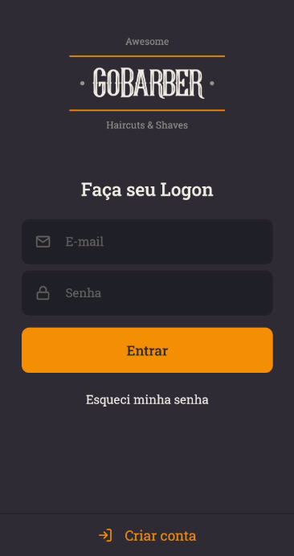

# GoBarber Mobile

<small>[Backend](https://github.com/martins20/GoBarber-Backend)</small> 
<small>[Figma](https://www.figma.com/file/VsKPJZgj03jPLsGTBpWdb1/GoBarber?node-id=0%3A1)

A beauty service appointments app

 
 

 
 

## :question: How to run

- Make sure you have [NodeJS](https://nodejs.org/) installed on your machine
- Clone this project on your machine
- Open the root folder on terminal and write `yarn` or `npm i` to install all packages
- then run the project writing `yarn start` or `npm run start`

## :sunglasses: Features

- [x] - User can create an account.
- [x] - User can login with your account.

## :computer: Techs

- React Native
- Typescript
- React-Navigation
- Stack-Navigation
- React-Gesture-Handlers
- Unform
- Styled-Components
- Axios
- Yup

#### Made with :heart: by martins20 and [RocketSeat](https://rocketseat.com.br) :heart:
